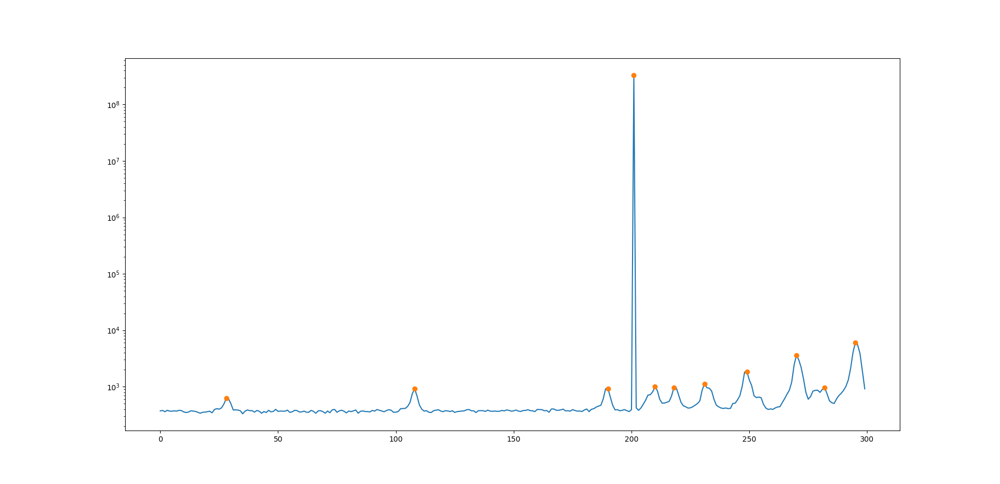

## Description

Find a filtered subset of local maxima in 1D slice of data.

The functionality implemented here is might be familiar to anyone using MATLAB's `findpeaks`, or Python's `scipy.signal.find_peaks`.

Arguably, the most useful feature in this package is filtering peaks through [prominence](https://en.wikipedia.org/wiki/Topographic_prominence).
This parameter allows you to get the subset of local maxima that optically look like peaks even in noisy data.

Filtering conditions that can be set are:

* prominence,
* height,
* the absolute value of the difference between neighboring data points,
* number of plateau points a peak can have,
* distance between peaks.

All parameters can be specified by minimum and maximum bound.

Elements of the data slice need not be of a specific type, as long as they implement a few traits (for cloning, subtraction, comparison).

## Example

Copied from [examples/spectrum.rs](./examples/spectrum.rs).

```rust
use find_peaks::PeakFinder;

use std::fs::File;
use std::io::prelude::*;

fn read_file(path: &str) -> std::io::Result<String> {
    let mut file = File::open(path)?;
    let mut contents = String::new();
    file.read_to_string(&mut contents)?;
    Ok(contents)
}

fn main() -> () {
    let data: Vec<f64> = read_file("data/spectrum.dat").expect("File not read!").as_str()
        .split_whitespace()
        .map(|x| x.parse::<f64>().unwrap())
        .collect();
    
    let mut fp = PeakFinder::new(&data);
    fp.with_min_prominence(200.);
    fp.with_min_height(0.);

    let peaks = fp.find_peaks();
    for p in peaks {
        println!("{} {}", p.middle_position(), p.height.unwrap());
    }
}
```

The result visualized:


